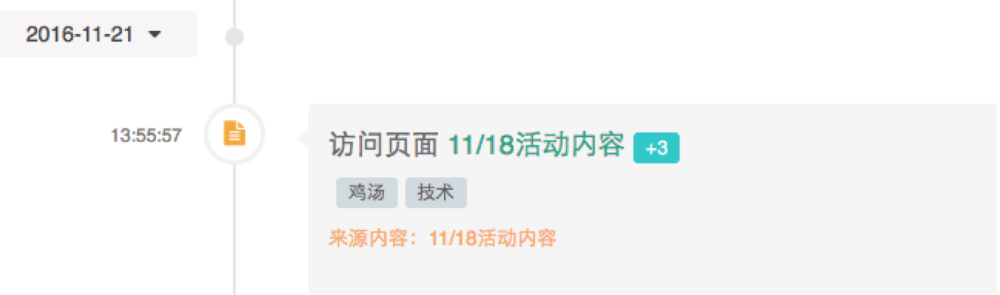

## 获取客户事件的API

**调用请求**
```
HTTP请求方式: GET
https://api.convertlab.com/v1/customerevents?access_token={access_token}
```  
**参数说明**

- {access_token}用从“获取身份权限”节拿到的access_token替换
- 除了access_token参数外，该API还支持以下参数来缩小查询结果集:
	- customerId 查询某个客户的行为事件
	- events 以逗号隔开的事件列表
	- lastUpdatedFrom 事件更新的起始时间(包含)
	- lastUpdatedTo 事件更新的结束时间(包含)
	- max 查询事件的数量，默认为20 （目前最多可以得到1000个事件，后期版本会允许获取更多事件
- 除了以上查询参数外，该API还支持分页和排序参数
	- rows 每页的记录数
	- page 第几页
	- sidx 排序的字段, 比如sidx=lastUpdated是按照lastUpdated字段排序
	- sord 排序的方式, asc是升序，desc是降序

**客户事件的字段信息**

这里仅列出了部分的客户事件字段，更多字段请查看API的返回值。

|参数名|数据类型|说明|
|:---|:---|:---|  
|id|number|事件id|
|customerId|number|客户的DM Hub id| 
|event|string|事件类型| 
|eventGroup|string|事件所属分组|
|targetId|string|由event类型决定, 具体请查看event元数据|
|targetName|string|由event类型决定, 具体请查看event元数据|
|date|datetime string|事件发生时间，格式为"2016-04-01T13:39:32Z"|
|location|string|事件发生的地点|
|channelType|string|事件发生的触点类型|
|channelAccount|string|事件发生的触点id|
|lastUpdated|datetime string|最后更新时间|
|source|bool|来源|
|score|int|增加或减少的评分|
|tag|string|标签|
|pageId|string|微页面的id|

客户事件的各个字段的具体意义，在客户事件的元数据中有描述。关于元数据，请查看后面章节。
- - -

## 获取事件的元数据

**获得事件元数据的API调用请求**
```
HTTP请求方式: GET
https://api.convertlab.com/v1/meta/event?access_token={access_token}
```
**示例**

下面以访问微页面事件为例，解释元数据的阅读方法。

以下是访问页面事件的元数据：
```
{
  "forContact": true,
  "isDropdown": true,
  "label": "访问页面",
  "name": "open_page",
  "score": 3,
  "stage": "Subscriber",
  "target": "Page",
  "title": "访问页面 <a target='_blank' href='/application/page/pages.html?uuid={targetId}'>{targetName}</a>" 
}
```
对应的客户事件为：
```
{
  "attr1": null,
  "attr2": null,
  "attr3": null,
  "attr4": null,
  "attr5": null,
  "batchId": null,
  "campaign": null,
  "campaignName": null,
  "channelAccunt": null,
  "channelType": "wechat",
  "contentName": null,
  "customerId": 2951,
  "date": "2016-11-21T05:55:57Z",
  "device": null,
  "employee": null,
  "event": "open_page",
  "externalId": null,
  "fromCollector": true,
  "id": 1737702,
  "inboud": true,
  "internalContentId": null,
  "lastForwarder": null,
  "lastUpdated": "2016-11-21T05:55:58Z",
  "location": null,
  "pageId": "c452179b742b44f08c15a299b9988893",
  "refScore": 2,
  "referrer": null,
  "referrerName": null,
  "score": 3,
  "source": null,
  "summary": null,
  "tag": "鸡汤，技术",
  "targetId": "c452179b742b44f08c15a299b9988893",
  "targetName": "11/18活动内容"
}
```
根据元数据和客户事件渲染的时间轴部分如下图所示：


* 时间轴的时间对应客户事件的date字段
* 时间轴的“访问页面11/18活动内容”是将客户事件中targetId和targetName替换到客户元数据中title中占位符的结果
* 时间轴的+3对应客户事件的score字段
* 标签对应客户事件的tag字段
* 来源内容对应于访问页面事件来说就是客户事件的targetName
