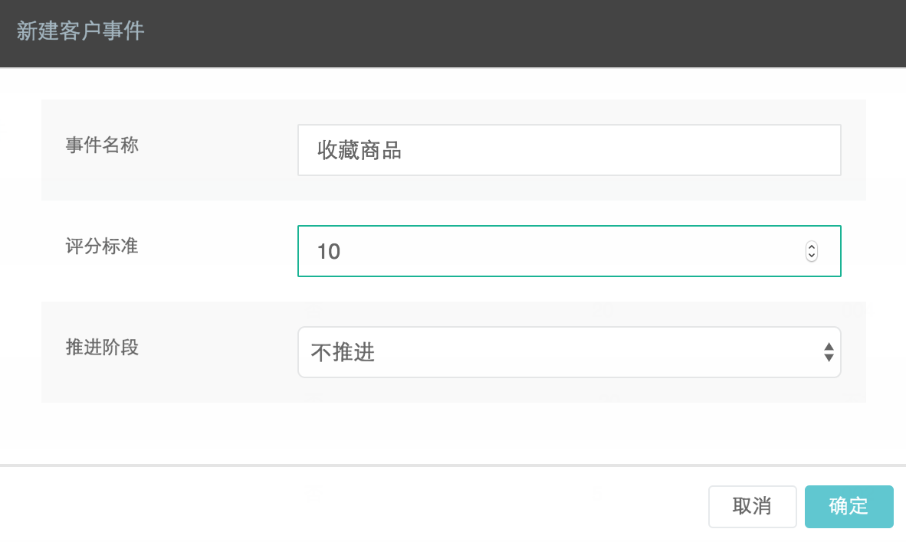

登录DM Hub系统，点击菜单中的**客户>客户设置>客户关键事件**中的**新建客户事件**。


点击**确定**，在事件列表中点击新建事件中的i图标，获取自定义事件ID：


## 通过标签添提交自定义事件
track()函数的参数event, targetName, targetId可以使用标签的形式向服务器提交。在按钮或链接上，分别添加如下属性：
- data-cl-event: 相当于track的event参数
- data-cl-name: 相当于track的targetName参数
- data-cl-id:  相当于track的targetId参数

```
<button data-cl-event=‘c_1483532925683’ data-cl-name=’收藏商品’ data-cl-id=’p001’>收藏</button>
```
- - -

## 通过meta标签提交阅读标签
除了在页面参数中指定内容标签外，还可以通过meta标签，给阅读过该页面的用户打上阅读标签，方法如下：

```
<meta name=”cl_content_tag” content=”咖啡,提神”>
```


